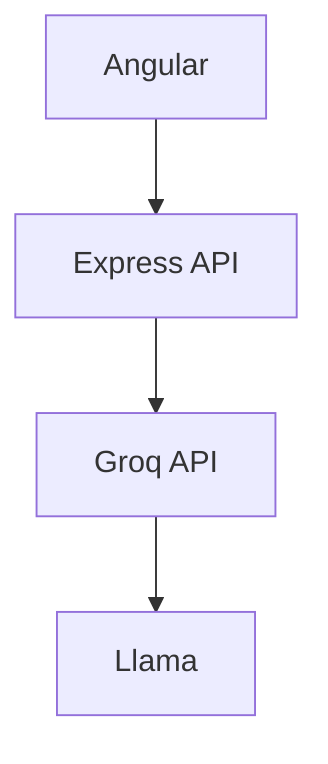

# <h3># In development 🚀</h3>


# AI Documentation Assistant

> Aplicación web tipo SaaS que utiliza Inteligencia Artificial para generar documentación técnica mediante modelos de lenguaje (LLMs).


---

## 📖 Descripción

**AI Documentation Assistant** es una aplicación web diseñada para ayudar a desarrolladores a generar documentación técnica utilizando Inteligencia Artificial.

El objetivo del proyecto es construir una arquitectura moderna, escalable y mantenible que demuestre buenas prácticas en el desarrollo Full Stack, integrando un modelo de lenguaje mediante una API compatible con OpenAI.

Este proyecto forma parte de un portafolio profesional enfocado en demostrar experiencia en:

* Integración de modelos de IA (LLMs)
* Desarrollo Backend con Node.js y Express
* Desarrollo Frontend con Angular
* Consumo de APIs REST
* Arquitecturas escalables
* Manejo profesional de errores
* Diseño de aplicaciones SaaS

---

# ✨ Características

* 🤖 Chat con Inteligencia Artificial
* 📚 Generación de documentación técnica
* 🧠 Integración con Groq API
* ⚡ Uso del SDK compatible con OpenAI
* 💬 Historial de conversación
* ✅ Validación de mensajes
* 🚨 Manejo centralizado de errores
* 🏗 Arquitectura modular preparada para crecer

---

# 🏗 Arquitectura

```text
                        AI Documentation Assistant

+---------------------------+
|      Angular Frontend     |
+---------------------------+
              |
              | HTTP REST
              ▼
+---------------------------+
|   Node.js + Express API   |
+---------------------------+
              |
              ▼
+---------------------------+
|        Groq API           |
+---------------------------+
              |
              ▼
+---------------------------+
|       Llama Model         |
+---------------------------+
```

---

# 🛠 Tecnologías

## Backend

* Node.js
* Express
* JavaScript
* Groq API
* OpenAI SDK
* dotenv

## Frontend (Próximamente)

* Angular
* TypeScript
* HttpClient
* Feature-Based Architecture

---

# 📂 Estructura del proyecto

```text
backend/
└── src/
    ├── config/
    │   └── llm.js
    │
    ├── controllers/
    │   └── ai.controller.js
    │
    ├── conversations/
    │   └── conversation.store.js
    │
    ├── errors/
    │   └── AppError.js
    │
    ├── middlewares/
    │   └── error.middleware.js
    │
    ├── prompts/
    │   └── documentation.prompt.js
    │
    ├── routes/
    │   └── ai.routes.js
    │
    ├── services/
    │   └── llm.service.js
    │
    └── validators/
        └── chat.validator.js
```

---

# 🚀 API

## Endpoint principal

```http
POST /api/ai/chat
```

### Request

```json
{
  "conversationId": "test-001",
  "message": "¿Qué es una API REST?"
}
```

### Response

```json
{
  "conversationId": "test-001",
  "answer": "Una API REST es..."
}
```

---

# 🧠 Flujo de la aplicación

```text
Cliente

      │

      ▼

Controller

      │

      ▼

LLM Service

      │

      ▼

Groq API

      │

      ▼

Modelo Llama
```

---

# 🤖 Integración con IA

La aplicación utiliza el SDK oficial compatible con OpenAI configurado para consumir la API de **Groq**, permitiendo cambiar de proveedor con un impacto mínimo en la arquitectura.

La configuración del cliente se encuentra desacoplada de la lógica de negocio para facilitar su mantenimiento.

---

# 💬 Prompt del sistema

El comportamiento del asistente se encuentra separado mediante un prompt dedicado.

```
src/prompts/documentation.prompt.js
```

Esto permite crear fácilmente nuevos asistentes especializados.

Ejemplos:

```text
prompts/

documentation.prompt.js
code-review.prompt.js
user-story.prompt.js
rag.prompt.js
```

---

# ✅ Validaciones

Actualmente el backend valida:

* Existencia del mensaje
* Estructura del request
* Arreglo de mensajes
* Contenido del mensaje
* Roles permitidos

Roles soportados:

* `system`
* `user`
* `assistant`

---

# ⚠ Manejo de errores

El proyecto implementa un sistema centralizado de manejo de errores mediante:

* `AppError`
* `error.middleware.js`

Ejemplo de respuesta:

```json
{
  "success": false,
  "error": {
    "message": "The AI service is currently unavailable"
  }
}
```

---

# 💬 Historial de conversación

Actualmente el historial se almacena en memoria utilizando un `Map`.

```text
conversationId

├── User
├── Assistant
├── User
└── Assistant
```

> **Nota:** El historial se pierde al reiniciar el servidor.

En futuras versiones se implementará persistencia utilizando:

* PostgreSQL
* Redis
* MongoDB

---

# 🎨 Frontend

El frontend se desarrollará utilizando Angular bajo una arquitectura **Feature-Based**.

```text
src/app/

├── core/
│
├── shared/
│
└── features/

    └── ai-assistant/

        ├── components/
        │
        ├── services/
        │
        ├── models/
        │
        └── pages/
```

## Componentes principales

### AiAssistantPage

Página principal encargada de coordinar la aplicación.

### ChatWindow

Muestra la conversación entre el usuario y el asistente.

### Message

Representa un mensaje individual.

Tipos soportados:

* user
* assistant
* system

### PromptInput

Campo para capturar el mensaje del usuario y enviarlo al backend.

---

# 🎯 Diseño

La interfaz está inspirada en aplicaciones modernas como:

* GitHub Copilot
* Cursor
* Linear
* Vercel

Características principales:

* 🌙 Dark Mode
* 📂 Sidebar
* 💬 Historial de conversaciones
* 📁 Gestión de proyectos
* 📚 Documentación
* 🧠 Panel de contexto
* ✨ Renderizado Markdown
* 🎨 Resaltado de código

---

# 📅 Roadmap

## Frontend

* [ ] Crear proyecto Angular
* [ ] Implementar arquitectura Feature-Based
* [ ] Crear componentes
* [ ] Consumir API REST
* [ ] Mostrar respuestas dinámicamente
* [ ] Renderizado Markdown
* [ ] Syntax Highlighting

## Backend

* [x] API REST
* [x] Integración con Groq
* [x] SDK OpenAI
* [x] Validaciones
* [x] Manejo de errores
* [x] Historial básico

## Futuras mejoras

### Autenticación

* [ ] Usuarios
* [ ] Login
* [ ] Proyectos privados

### Persistencia

* [ ] PostgreSQL
* [ ] Redis
* [ ] MongoDB

### Nuevos módulos

```text
features/

├── ai-assistant
├── code-review
├── api-documentation
├── user-story-generator
└── rag-chat
```

---

# 📊 Estado del proyecto

| Módulo            | Estado           |
| ----------------- | ---------------- |
| Backend           | ✅ Funcional      |
| API REST          | ✅ Funcional      |
| Integración LLM   | ✅ Funcional      |
| Groq              | ✅ Funcional      |
| Prompt separado   | ✅ Implementado   |
| Validaciones      | ✅ Implementado   |
| Manejo de errores | ✅ Implementado   |
| Historial         | ✅ Básico         |
| Frontend Angular  | 🚧 En desarrollo |
| Persistencia      | ⏳ Pendiente      |
| Autenticación     | ⏳ Pendiente      |

---

# 🚀 Próximo objetivo

Desarrollar el frontend en Angular utilizando una arquitectura **Feature-Based** y conectar la interfaz de chat con el backend para ofrecer una experiencia similar a herramientas como GitHub Copilot, Cursor o ChatGPT.

---

# 📄 Licencia

Este proyecto fue desarrollado con fines educativos, uso personal y como parte de un portafolio profesional.


<p align="center">
  
</p>

<h1 align="center">
AI Documentation Assistant
</h1>

<p align="center">
Genera documentación técnica con Inteligencia Artificial.
</p>

<p align="center">


</p>

---

## ✨ Overview

AI Documentation Assistant es una aplicación tipo SaaS que utiliza modelos de lenguaje para generar documentación técnica de software.

Su objetivo es demostrar una arquitectura Full Stack moderna basada en:

- Angular
- Node.js
- Express
- Groq API
- LLMs
- Arquitectura modular
- Buenas prácticas de desarrollo

---

## 🎥 Demo

> Próximamente

GIF del chat funcionando

---

## 🚀 Features

- 🤖 Chat con IA
- 📚 Documentación automática
- 💬 Conversaciones persistentes
- ⚡ Integración con Groq
- 🔒 Manejo profesional de errores
- ✅ Validaciones
- 🧩 Arquitectura escalable

---

## 🏛 Arquitectura



---

## 📦 Stack

| Backend | Frontend | AI |
|----------|-----------|----|
| Node.js | Angular | Groq |
| Express | TypeScript | Llama |
| dotenv | RxJS | OpenAI SDK |

---

## 📂 Project Structure

```text
backend/
src/

config/
controllers/
middlewares/
prompts/
routes/
services/
validators/
```

---

## ⚙️ Installation

```bash
git clone ...

cd backend

npm install
```

Crear archivo:

```
.env
```

```env
GROQ_API_KEY=xxxx
PORT=3000
```

Iniciar servidor

```bash
npm run dev
```

---

## 📡 API

### POST

```
/api/ai/chat
```

Request

```json
{
 "conversationId":"test",
 "message":"Documenta este endpoint"
}
```

Response

```json
{
 "conversationId":"test",
 "answer":"..."
}
```

---

## 📈 Roadmap

### Backend

- [x] LLM
- [x] API REST
- [x] Validaciones
- [x] Error Handling

### Frontend

- [ ] Angular
- [ ] Markdown
- [ ] Syntax Highlight

### Futuro

- [ ] Login
- [ ] PostgreSQL
- [ ] Redis
- [ ] RAG
- [ ] Code Review
- [ ] API Documentation

---

## 📸 Screenshots

| Chat |
|------|
| *(imagen aquí)* |

---

## 📄 License

MIT


