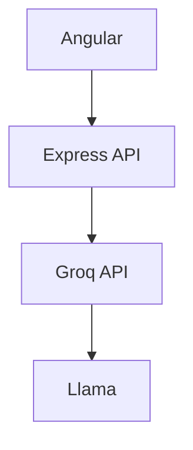

<h1 align="center">
AI Documentation Assistant
</h1>

<p align="center">
Genera documentación técnica con Inteligencia Artificial.
</p>

<p align="center">


</p>

---

## ✨ Overview

AI Documentation Assistant es una aplicación tipo SaaS que utiliza modelos de lenguaje para generar documentación técnica de software.

## 🎯 Problema

La documentación técnica suele ser una de las tareas más repetitivas y que más tiempo consume durante el desarrollo de software. Mantenerla actualizada y consistente puede convertirse en un desafío a medida que los proyectos crecen.

**AI Documentation Assistant** utiliza Inteligencia Artificial para asistir a los desarrolladores en la generación de documentación técnica de forma rápida, precisa y con un formato uniforme, permitiendo dedicar más tiempo al desarrollo y menos a tareas repetitivas.

Su objetivo es demostrar una arquitectura Full Stack moderna basada en:

- Angular
- Node.js
- Express
- Groq API
- LLMs
- Arquitectura modular
- Buenas prácticas de desarrollo

---

## 🎥 Demo

> Próximamente

---

## 🚀 Features

- 🤖 Chat con IA
- 📚 Documentación automática
- 💬 Conversaciones persistentes
- ⚡ Integración con Groq
- 🔒 Manejo profesional de errores
- ✅ Validaciones
- 🧩 Arquitectura escalable

---

## 🏛 Arquitectura



---

## 📦 Stack

| Backend | Frontend | AI |
|----------|-----------|----|
| Node.js | Angular | Groq |
| Express | TypeScript | Llama |
| dotenv | RxJS | OpenAI SDK |

---

## 📂 Project Structure

```text
backend/
src/

config/
controllers/
middlewares/
prompts/
routes/
services/
validators/
```

---

## ⚙️ Installation

```bash
git clone ...

cd backend

npm install
```

Crear archivo:

```
.env
```

```env
GROQ_API_KEY=xxxx
PORT=3000
```

Iniciar servidor

```bash
npm run dev
```

---

## 📡 API

### POST

```
/api/ai/chat
```

Request

```json
{
 "conversationId":"test",
 "message":"Documenta este endpoint"
}
```

Response

```json
{
 "conversationId":"test",
 "answer":"..."
}
```

---

## 📈 Roadmap

### Backend

- [x] LLM
- [x] API REST
- [x] Validaciones
- [x] Error Handling

### Frontend

- [ ] Angular
- [ ] Markdown
- [ ] Syntax Highlight

### Futuro

- [ ] Login
- [ ] PostgreSQL
- [ ] Redis
- [ ] RAG
- [ ] Code Review
- [ ] API Documentation

---

## 📸 Screenshots

| Chat |
|------|
| 
 |

---

## 📄 License

MIT


